1 - Mise en place de l'environnement  
Installation de docker  

```bash
[dash@localhost ~]$sudo dnf install -y dnf-plugins-core
[dash@localhost ~]$sudo dnf config-manager --add-repo https://download.docker.com/linux/centos/docker-ce.repo
[dash@localhost ~]$sudo dnf install -y docker-ce docker-ce-cli containerd.io
[dash@localhost ~]$sudo systemctl enable docker
[dash@localhost ~]$sudo systemctl start docker
[dash@localhost ~]$ docker --version
Docker version 28.0.0, build f9ced58

```

Installation de docker compose  

```bash
[dash@localhost ~]sudo curl -L "https://github.com/docker/compose/releases/latest/download/docker-compose-$(uname -s)-$(uname -m)" -o /usr/local/bin/docker-compose
[dash@localhost ~]sudo chmod +x /usr/local/bin/docker-compose
[dash@localhost ~]$ docker-compose version
Docker Compose version v2.33.1

```

Création du dossier de travail

```bash
[dash@localhost ~]$mkdir tp-wordpress
[dash@localhost ~]cd tp-wordpress
[dash@localhost tp-wordpress]$ nano docker-compose.yml
```
Le fichier de configuration est le suivant : 

2 - Déploiement de la solution  

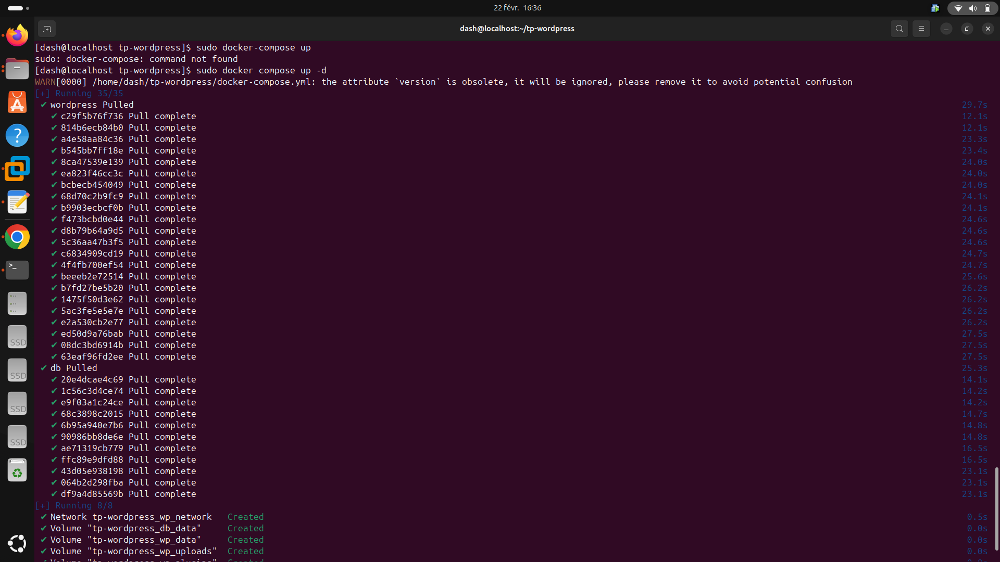  

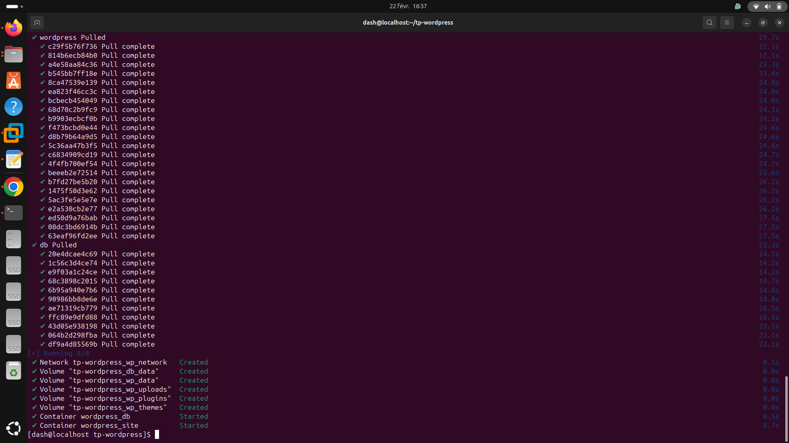  

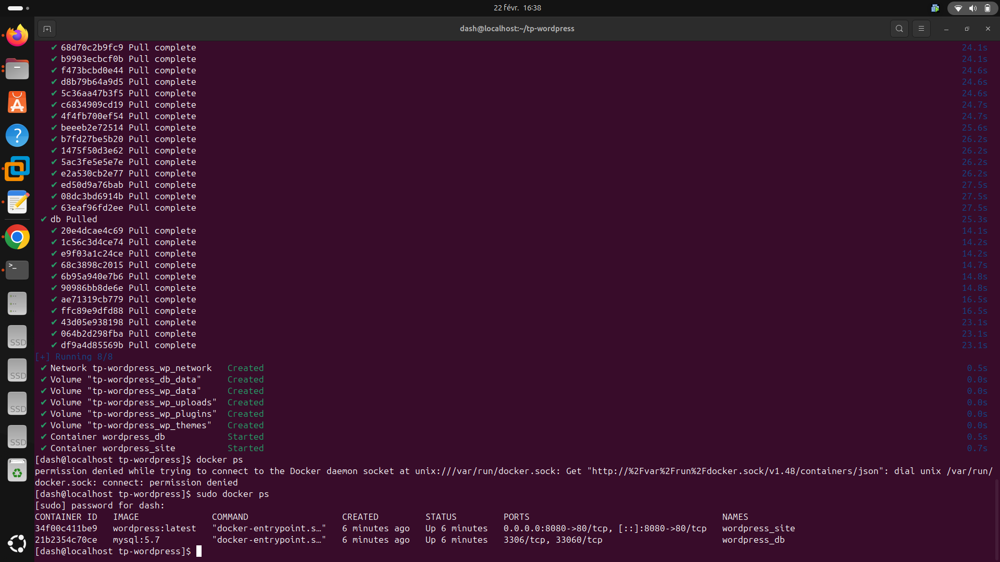  

Configuration de Wordpress  

Depuis le navigateur de ma machine physique  

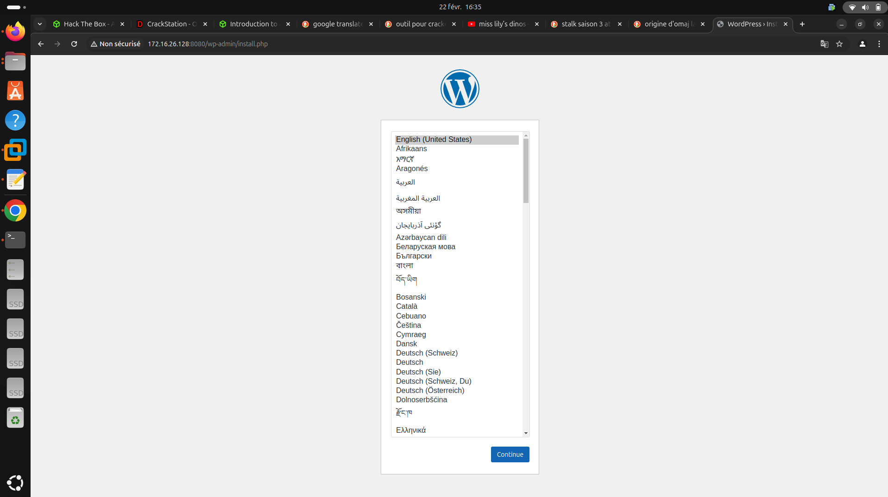  

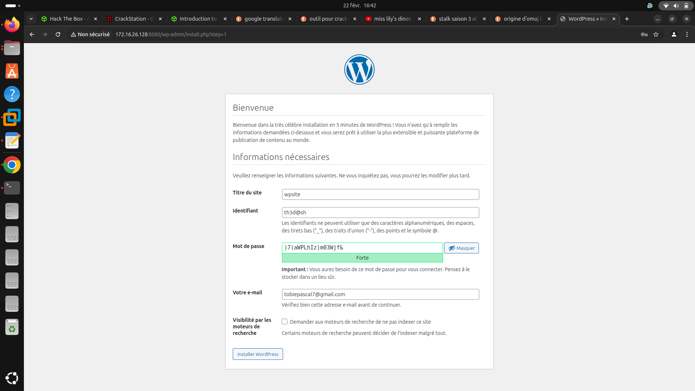  

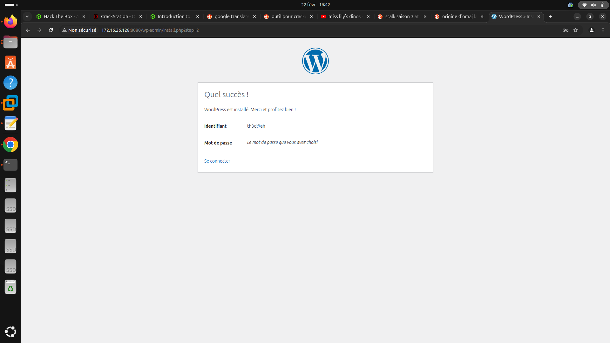  

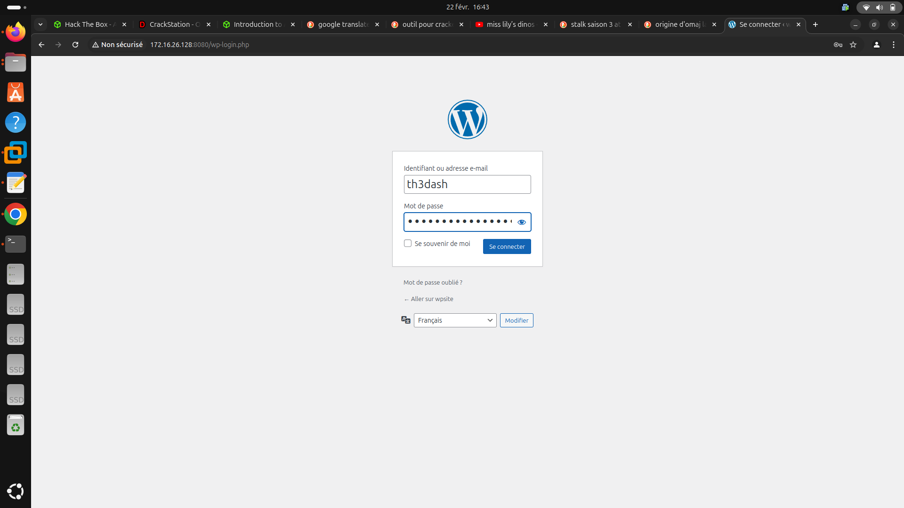  

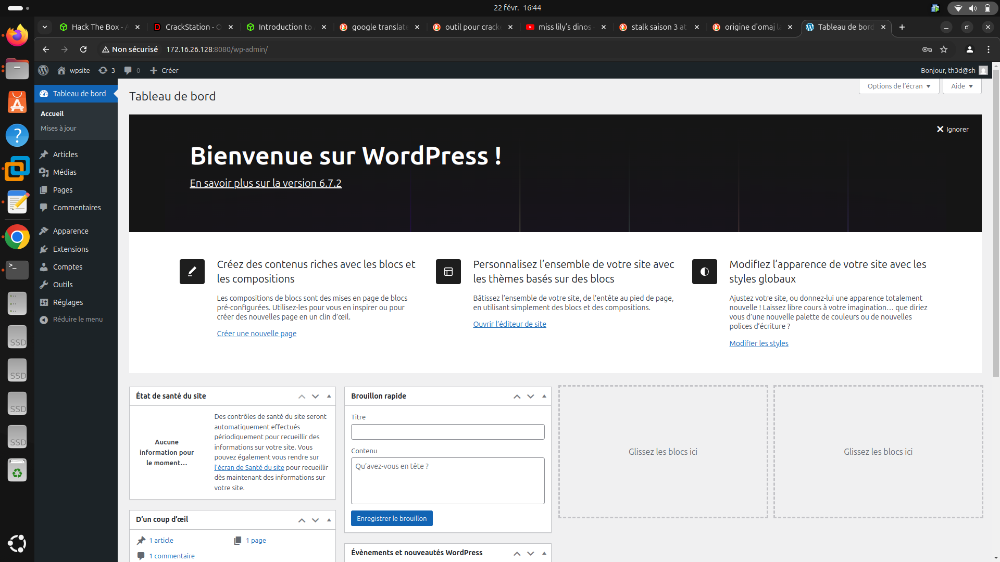  

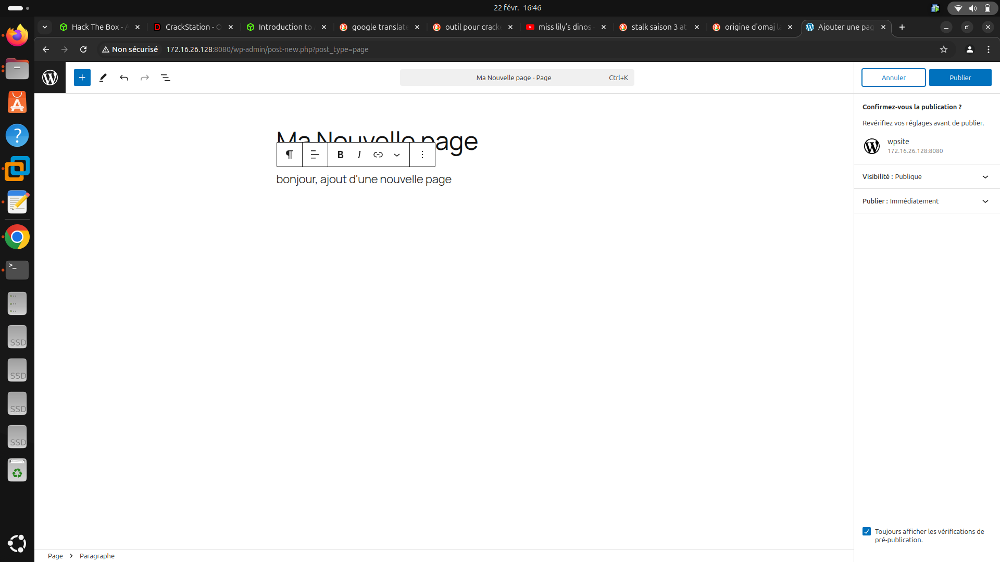   

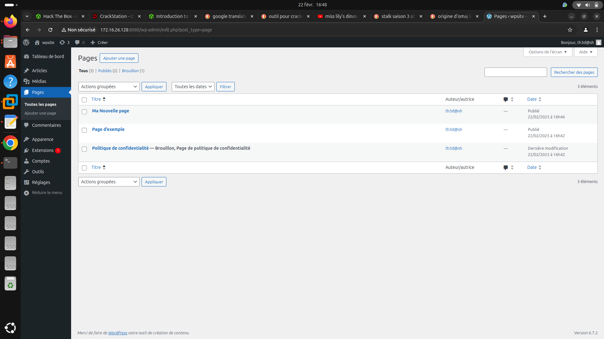  

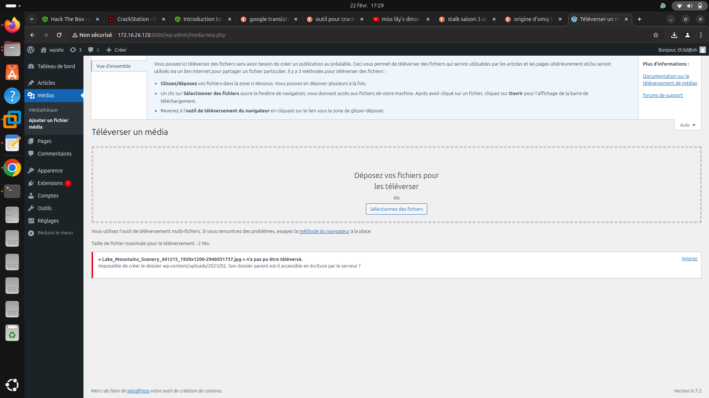  

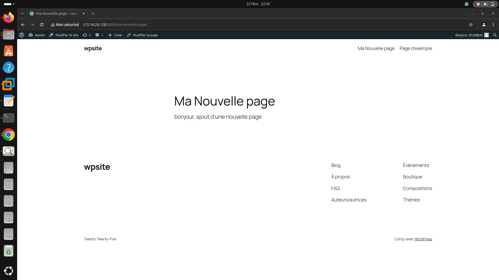 


