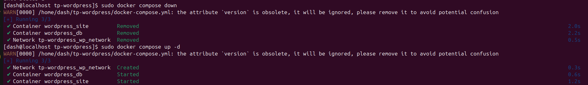
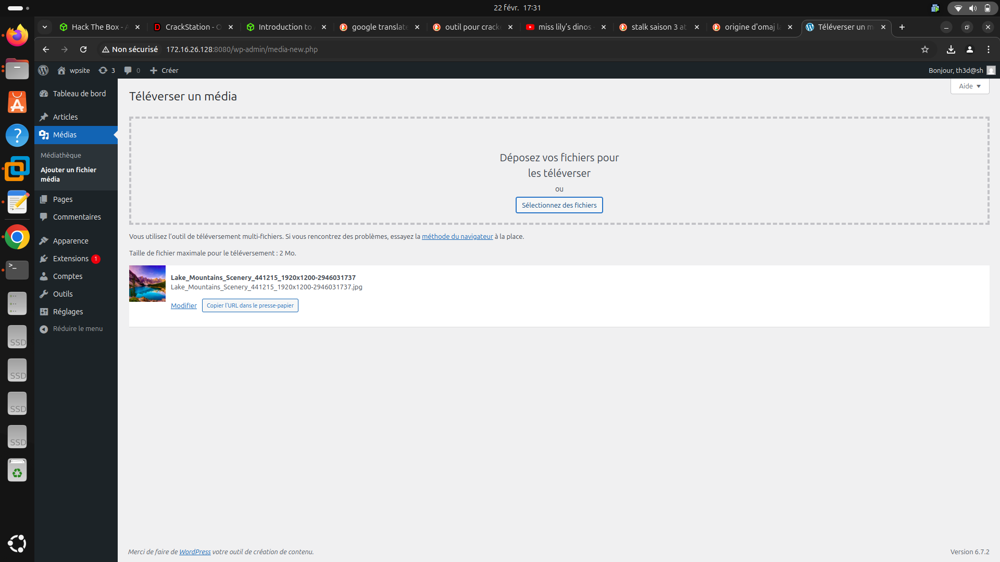
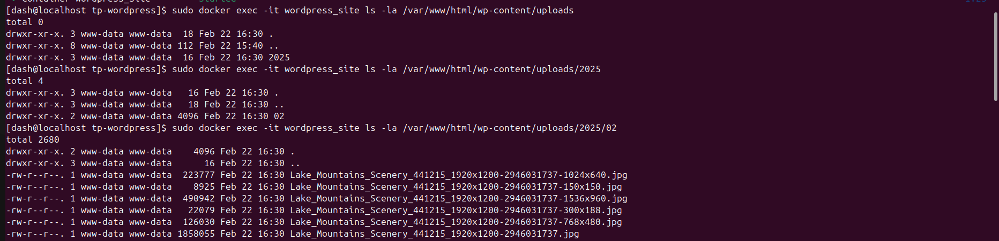

# 1 - Contexte :  

Dans le cadre de ce TP, il est question de déployer une solution Wordpress couplée a une base de données MySQL et le tout orchestré par le fichier [docker-compose.yml](docker-compose.yml)

- Setup

Pour ce TP je me connecte en SSH depuis ma machine physique à une machine virtuelle Rocky Server.    
<br>    
        


# 2 - Mise en place de l'environnement  
- Installation de docker  

```bash
[dash@localhost ~]$sudo dnf install -y dnf-plugins-core
[dash@localhost ~]$sudo dnf config-manager --add-repo https://download.docker.com/linux/centos/docker-ce.repo
[dash@localhost ~]$sudo dnf install -y docker-ce docker-ce-cli containerd.io
[dash@localhost ~]$sudo systemctl enable docker
[dash@localhost ~]$sudo systemctl start docker
[dash@localhost ~]$ docker --version
Docker version 28.0.0, build f9ced58

```

- Installation de docker compose  

```bash
[dash@localhost ~]sudo curl -L "https://github.com/docker/compose/releases/latest/download/docker-compose-$(uname -s)-$(uname -m)" -o /usr/local/bin/docker-compose
[dash@localhost ~]sudo chmod +x /usr/local/bin/docker-compose
[dash@localhost ~]$ docker-compose version
Docker Compose version v2.33.1

```

- Création du dossier de travail

```bash
[dash@localhost ~]$mkdir tp-wordpress
[dash@localhost ~]cd tp-wordpress
[dash@localhost tp-wordpress]$ nano docker-compose.yml
```
Le fichier de configuration est le suivant : [docker-compose.yml](docker-compose.yml)     
<br>

# 3 - Explications de la conf du fichier

- Pour le service MySQL :<br>
`image: mysql:5.7` → Utilisation d’une version stable de MySQL.<br>
`environment` → Définit les variables pour initialiser la base de données.<br>
`volumes` → Permet de conserver les données MySQL même après redémarrage.<br>
`networks` → Connecte la base de données au réseau wp-network pour la communication avec WordPress.<br>

- Pour Wordpress :<br>
`image: wordpress:latest` → Utilisation de l’image officielle WordPress.<br>
`restart: always` → Redémarre automatiquement si le conteneur s’arrête.<br>
`ports: "8080:80"` → WordPress sera accessible via http://localhost:8080.<br>
`environment` → Définit les variables d’environnement pour la connexion à MySQL.<br>
`volumes` → Assure la persistance des données (uploads, thèmes, plugins).<br>
`networks` → Permet à WordPress de communiquer avec MySQL via un réseau Docker.<br>

<br>

# 4 - Déploiement de la solution  

je lance le fichier de configuration avec la commande `sudo docker compose up -d`
  

  

Ensuite, la commande `sudo docker ps` permet de voir les conteneurs en cours d'execution
  

- Configuration de Wordpress  

Depuis le navigateur de ma machine physique, j'accède au site Wordpress via le port `8080`
  

Ensuite je définis les identifiants  
  

Puis, je valide le compte et je me connecte ensuite  
  

  

  

- Création d'une nouvelle page<br>

Je crée une nouvelle page  
   

  

Je vérifie que la page est bien créée
 

- Vérification de l'upload  
  
<br>

L'upload ne fonctionne pas convenablement. D'après le message d'erreur, notre serveur ne peut pas écrire dans le repertoire `uploads`. Nous allons donc vérifier les permissions de ce repertoire.  
Pour ce faire nous utilisons la commande `sudo docker exec -it wordpress_site ls -la /var/www/html/wp-content`.   

Nous remarquons que ce repertoire appartient au `root` et par conséquent l'utilisateur `www-data` ne peut pas écrire dans ce repertoire. Il est donc question de faire passer ce repertoire à l'utilisateur `www-data` et à son groupe.  
Cela se fait grace à la commande `sudo docker exec -it wordpress_site chown -R www-data:www-data /var/www/html/wp-content/uploads`  


Ensuite, je relance le docker-compose et j'éssaie l'upload à nouveau.  



 

On peut s'apercevoir que l'upload a bien pu fonctionner.  

 
