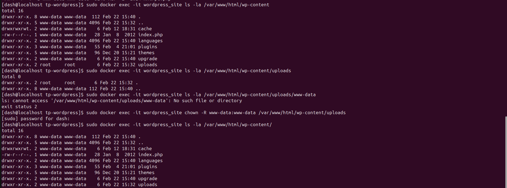

1 - Mise en place de l'environnement  
Installation de docker  

```bash
[dash@localhost ~]$sudo dnf install -y dnf-plugins-core
[dash@localhost ~]$sudo dnf config-manager --add-repo https://download.docker.com/linux/centos/docker-ce.repo
[dash@localhost ~]$sudo dnf install -y docker-ce docker-ce-cli containerd.io
[dash@localhost ~]$sudo systemctl enable docker
[dash@localhost ~]$sudo systemctl start docker
[dash@localhost ~]$ docker --version
Docker version 28.0.0, build f9ced58

```

Installation de docker compose  

```bash
[dash@localhost ~]sudo curl -L "https://github.com/docker/compose/releases/latest/download/docker-compose-$(uname -s)-$(uname -m)" -o /usr/local/bin/docker-compose
[dash@localhost ~]sudo chmod +x /usr/local/bin/docker-compose
[dash@localhost ~]$ docker-compose version
Docker Compose version v2.33.1

```

Création du dossier de travail

```bash
[dash@localhost ~]$mkdir tp-wordpress
[dash@localhost ~]cd tp-wordpress
[dash@localhost tp-wordpress]$ nano docker-compose.yml
```
Le fichier de configuration est le suivant : 

2 - Déploiement de la solution  

On lance le fichier de configuration avec la commande `sudo docker compose up -d`
  

  

On utilise ensuite la commande `sudo docker ps` pour voir les conteneurs en cours d'execution
  

Configuration de Wordpress  

Depuis le navigateur de ma machine physique  
  

Ensuite on définit les identifiants  
  

On valide le compte et on se connecte ensuite  
  

  

  

On crée une nouvelle page  
   

  

On vérifie que la page est bien créée
 

Vérification de l'upload  
  
L'upload ne fonctionne pas convenablement. D'après le message d'erreur, notre serveur ne peut pas écrire dans le repertoire `uploads`. Nous allons donc vérifier les permissions de ce repertoire.  
Pour ce faire nous utilisons la commande `sudo docker exec -it wordpress_site ls -la /var/www/html/wp-content`
Nous remarquons que ce repertoire appartient au `root` et par conséquent l'utilisateur `www-data` ne peut pas écrire dans ce repertoire. Il est donc question de faire passer ce repertoire à l'utilisateur `www-data`et à son groupe.  
Cela se fait grace à la commande `sudo docker exec -it wordpress_site chown -R www-data:www-data /var/www/html/wp-content/uploads`  

